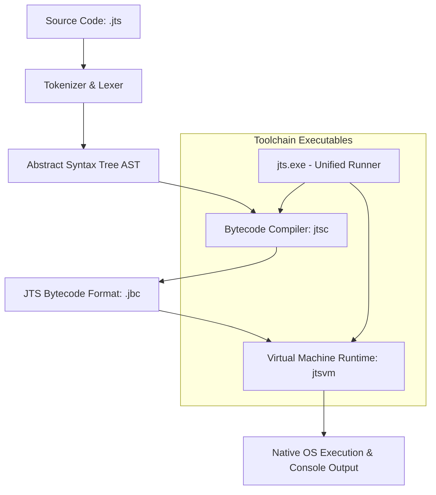

<div align="center">

  

  # JTS GO

  ### The Zero-Friction Programming Language & Integrated Studio

  *One installer. Zero configuration. Instant bytecode execution.*

  <p align="center">
    <a href="https://github.com/jayaswinjay-web/jtsdk/releases">
      
    </a>
    <a href="https://www.npmjs.com/package/@jaytechsolutions/jts-go">
      
    </a>
    <a href="https://jayaswinjay-web.github.io/jtsdk/">
      
    </a>
  </p>

  <p align="center">
    <a href="#-quick-start"><b>Quick Start</b></a> •
    <a href="#-why-jts-go-comparison"><b>Why JTS GO?</b></a> •
    <a href="#-architecture--vm-pipeline"><b>Architecture</b></a> •
    <a href="#-the-jts-ide-studio"><b>IDE Studio</b></a> •
    <a href="#-feature-showcase"><b>Code Showcase</b></a> •
    <a href="#-standard-library-reference"><b>Stdlib Reference</b></a> •
    <a href="#-roadmap-2026"><b>Roadmap</b></a>
  </p>

  ---
</div>

## 💡 What is JTS GO?

**JTS GO** is a high-level, dynamically-typed programming language powered by a custom **C-based Bytecode Virtual Machine**. It was engineered to eliminate setup fatigue for students, educators, and rapid tool builders.

Traditional languages require configuring environment variables, package managers (`pip`, `npm`), virtual environments, compilers, and IDE plugins before executing a single line of code. **JTS GO ships as a unified, zero-dependency ecosystem**:

- 🚀 **Zero-Config Runtime** — Single lightweight binary (`jts.exe`) compiles and executes `.jts` scripts in under 5ms.
- 🎨 **Bundled Studio IDE** — Free, native dark-mode Windows IDE with one-key execution (**F5**), interactive REPL, and visual diagnostics.
- 🧠 **Native AI & Tensor Engine** — Matrix math, multi-dimensional tensors, `sigmoid`, `relu`, and `mse` built directly into the language core.
- 🌐 **Embedded HTTP Server** — Microservices and REST APIs in 3 lines of code.
- 📦 **Built-In Tutorials** — 12 guided lessons included inside the installation payload.

---

## ⚡ Quick Start

### 1. Windows (Recommended — Includes IDE Studio)

Download the lightweight `.exe` installer from [Releases](https://github.com/jayaswinjay-web/jtsdk/releases). It automatically bundles:
- `jts.exe` (Runner & Compiler)
- `jtsc.exe` (Bytecode Compiler)
- `jtsvm.exe` (Bytecode Virtual Machine)
- `Jts.Ide.exe` (Official Studio IDE)
- Standard Library Scrolls & 12 Guided Lessons

### 2. Cross-Platform via npm

```bash
# Install globally on Windows, macOS, or Linux
npm install -g @jaytechsolutions/jts-go

# Verify installation
jts --version
```

### 3. Your First Program

Create `hello.jts`:
```jts
say("Hello, JTS GO!")
```

Run it instantly:
```bash
jts hello.jts
```

---

## 📊 Why JTS GO? (Comparison)

| Feature / Metric | JTS GO | Python | Node.js | C / C++ |
| :--- | :---: | :---: | :---: | :---: |
| **Setup Time to First Code** | **< 30 Seconds** | ~ 15 Minutes | ~ 10 Minutes | ~ 30+ Minutes |
| **Toolchain Size** | **~2 MB Single Binary** | ~ 100 MB+ | ~ 90 MB+ | ~ 500 MB+ (GCC/MSVC) |
| **Included IDE Studio** | **✅ Built-In Native IDE** | ❌ Separate (VS Code/PyCharm) | ❌ Separate | ❌ Separate |
| **Native Tensors & ML** | **✅ Stdlib Core (No `pip`)** | ❌ Needs `numpy`/`torch` | ❌ Needs external libs | ❌ Needs Eigen/LibTorch |
| **Built-In Web Server** | **✅ 3 Lines (No `express`)** | ❌ Needs `flask`/`fastapi` | ❌ Needs `express`/`http` | ❌ Complex sockets |
| **Block Syntax** | **Indentation + `end`** | Indentation only | Curly braces `{}` | Curly braces `{}` |
| **Cold VM Startup** | **< 5ms** | ~ 30-50ms | ~ 50-100ms | N/A (Compiled) |

---

## 🏗️ Architecture & VM Pipeline

JTS GO uses a modern two-pass compilation pipeline targeting a fast, register-based virtual machine:



1. **`jtsc` (Compiler)** parsing `.jts` source into compact binary bytecode files (`.jbc`).
2. **`jtsvm` (Virtual Machine)** executing `.jbc` bytecode with minimal memory footprint (< 10MB RAM).
3. **`jts` (CLI Driver)** providing seamless single-command compilation and execution.

---

## 🖥️ The JTS IDE Studio

The official JTS IDE Studio is built specifically for JTS GO developers, offering an uncluttered, responsive development workspace.

<div align="center">
  
</div>

### Key Features:
- **F5 Instant Execution** — Stream stdout and stderr directly to an embedded dark-mode output terminal.
- **F6 Bytecode Compilation** — Instantly emit production `.jbc` files.
- **Interactive REPL Session** — Execute snippets live without creating files.
- **Integrated Diagnostic Jump** — Double-click compiler error output to jump straight to the faulting line.
- **Workspace Explorer** — Multi-tab editor with file system tree navigation.
- **Built-In Tutorials** — Load interactive lessons directly into editor tabs with one click.

---

## 🎨 Feature Showcase

### 1. Embedded HTTP Web Microservice
```jts
# Create an HTTP server on port 8080
srv = http_server(8080)

# Register routes
http_route(srv, "GET", "/", "<h1>Welcome to JTS GO Web</h1>")
http_route(srv, "GET", "/api/status", '{"status": "online", "uptime": "ok"}')

# Launch server
say("Starting web server on http://localhost:8080...")
http_start(srv)
```

### 2. Machine Learning & Tensor Computations
```jts
# Create multidimensional tensors & matrices
t = tensor([1.0, 2.0, 3.0, 4.0])
m1 = matrix([[1, 2], [3, 4]])
m2 = matrix([[5, 6], [7, 8]])

# Matrix Multiplication & Activations
result = matmul(m1, m2)
say("MatMul Result:")
say(result)

# Activation & Loss evaluation
say("Sigmoid(0): " + str(sigmoid(0)))       # Output: 0.5
say("ReLU(-5): "    + str(relu(-5)))          # Output: 0
say("MSE Loss: "   + str(mse([1, 2], [1.1, 1.9])))
```

### 3. Object-Oriented Programming & Clean Inheritance
```jts
class Vehicle
    func init(self, brand, speed)
        self.brand = brand
        self.speed = speed
    end

    func info(self)
        say(self.brand + " travels at " + str(self.speed) + " km/h")
    end
end

class ElectricCar extends Vehicle
    func init(self, brand, speed, battery)
        super.init(self, brand, speed)
        self.battery = battery
    end

    func status(self)
        self.info()
        say("Battery level: " + str(self.battery) + "%")
    end
end

tes = new ElectricCar("JTS Model E", 220, 95)
tes.status()
```

### 4. Sets, Dictionaries & Collections
```jts
# Unique Set data structure
s = {10, 20, 30, 20, 10}
say("Set elements: " + str(s))    # Automatically deduplicated

# Dictionaries
config = {"theme": "dark", "tab_size": 4, "auto_save": true}
say("Theme setting: " + config["theme"])

# Bitwise operations
flags = 1 | 2 | 4
say("Combined flags: " + str(flags))
```

---

## 📖 Standard Library Reference

| Module / Function | Description | Example Usage |
| :--- | :--- | :--- |
| `say(val)` | Print value to standard output | `say("Hello World")` |
| `ask(prompt)` | Read typed input from user | `name = ask("Your name: ")` |
| `len(obj)` | Return length of string, list, or tensor | `length = len([1, 2, 3])` |
| `type(obj)` | Return string representation of variable type | `t = type(42)` |
| `number(str)` | Cast string to float/integer | `val = number("3.14")` |
| `str(val)` | Cast value to string | `txt = str(100)` |
| `math(fn, x)` | Perform math function (`sin`, `cos`, `sqrt`, `abs`, `log`, etc.) | `res = math("sqrt", 16)` |
| `tensor(data)` | Construct a 1D/2D Tensor object | `t = tensor([1, 2, 3])` |
| `matrix(data)` | Construct a Matrix object | `m = matrix([[1, 2], [3, 4]])` |
| `matmul(a, b)` | Multiply two matrices | `res = matmul(m1, m2)` |
| `sigmoid(x)` | Compute sigmoid activation $\frac{1}{1 + e^{-x}}$ | `s = sigmoid(0.5)` |
| `relu(x)` | Compute Rectified Linear Unit activation | `r = relu(-2)` |
| `mse(p, a)` | Compute Mean Squared Error between predicted & actual | `l = mse(preds, actual)` |
| `http_server(port)` | Initialize an HTTP microservice listener | `srv = http_server(8080)` |
| `http_route(srv, m, p, b)` | Register a route handler | `http_route(srv, "GET", "/", "OK")` |
| `http_start(srv)` | Start processing HTTP requests | `http_start(srv)` |
| `read_file(path)` | Read text file contents into memory | `content = read_file("data.txt")` |
| `write_file(path, data)` | Write text data to file | `write_file("log.txt", "OK")` |

---

## 📚 Guided Tutorial Path

JTS GO ships with a comprehensive 12-stage curriculum located in `tutorials/` and accessible directly inside the JTS IDE Studio:

1. `01_hello.jts` — Printing and interactive input (`say`, `ask`)
2. `02_variables_math.jts` — Data types, type annotations, and arithmetic
3. `03_conditionals.jts` — Logical branching with `if`, `elif`, `else`
4. `04_loops.jts` — Iteration using `for` and `while` loops
5. `05_strings.jts` — String manipulation (`upper`, `lower`, `substring`, `trim`)
6. `06_functions.jts` — Parameters, return values, and closures
7. `07_lists.jts` — Array methods (`sort`, `append`, `remove`, `pop`)
8. `08_dicts_sets.jts` — Dictionaries and deduplicated Sets
9. `09_classes.jts` — Object-Oriented Programming and inheritance
10. `10_files_json.jts` — File system read/write operations
11. `11_errors.jts` — Error handling with `try`, `catch`, `throw`
12. `12_ml_web.jts` — Advanced Machine Learning & HTTP Web services

---

## 🗺️ Roadmap (2026)

- [x] **v0.9.3 Core Engine** — Bytecode VM, Tensors, HTTP Server, Sets, OOP.
- [x] **Native Windows Studio IDE** — F5/F6 execution, AvalonEdit syntax engine, REPL.
- [x] **Global Distribution** — `npm` package publishing & native C++ standalone installer.
- [ ] **WASM Browser Playground** — In-browser JTS GO execution sandbox powered by WebAssembly.
- [ ] **AI Assistant Integration in Studio** — Intelligent inline code suggestions and automated error explanation.
- [ ] **Cross-Platform Studio IDE** — macOS & Linux native IDE desktop distribution.
- [ ] **Scroll Package Registry** — Centralized package registry for sharing user-created scrolls.

---

## 🤝 Community & Contributing

Contributions, feature requests, and bug reports are warmly welcome!

- **GitHub Discussions**: Share ideas, showcase projects, and ask questions in [Discussions](https://github.com/jayaswinjay-web/jtsdk/discussions).
- **Issue Tracker**: Submit bug reports and feature requests on [GitHub Issues](https://github.com/jayaswinjay-web/jtsdk/issues).

### Building from Source

```bash
# Clone the repository
git clone https://github.com/jayaswinjay-web/jtsdk.git
cd jtsdk

# Build toolchain & payload (requires .NET SDK for IDE)
powershell ./jtside/build.ps1
```

---

## 📄 License

**JTS GO** is open-source software released under the [Apache License 2.0](LICENSE).

```
Copyright (c) 2025–2026 JayTech Solutions. All Rights Reserved.
```

---

<div align="center">
  <b>Built with passion by JayTech Solutions</b><br>
  <i>Empowering the next generation of software developers.</i>
</div>
