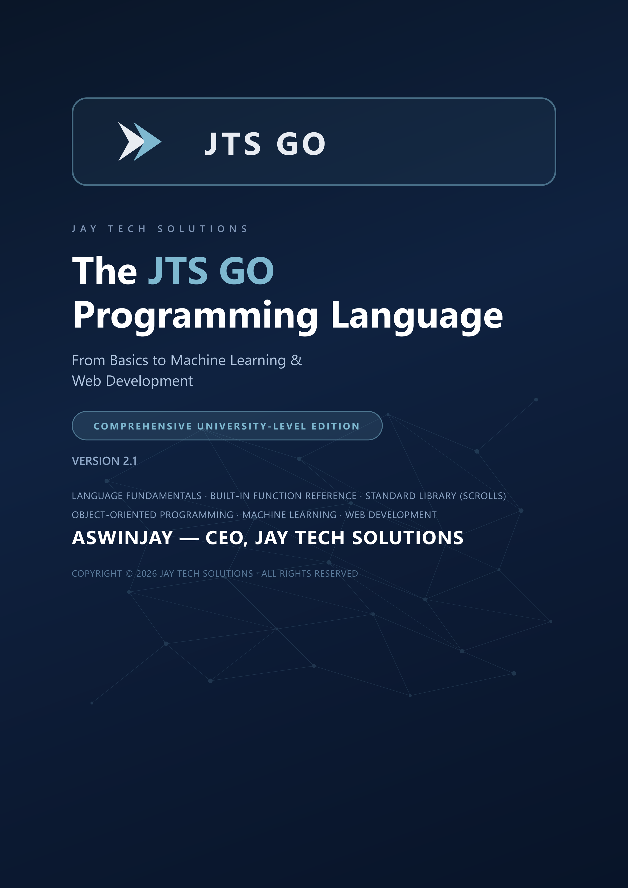

<div align="center">

# JTS GO

### The easiest programming language to learn — and it actually ships.


**One install. One command. From `say("Hello")` to web servers and ML in minutes.**

[Getting Started](#quick-start) · [The IDE](#jts-ide) · [Features](#why-jts-go) · [Docs](LEARNING_GUIDE.md) · [Examples](book) · [Discussions](https://github.com/jayaswinjay-web/jtsdk/discussions)

`npm install -g @jaytechsolutions/jts-go`


</div>

---

## Why JTS GO?

Most "easy" languages make you install a dozen tools before you write a line. **JTS GO ships everything** — interpreter, compiler, VM, standard library, tutorials, and a full Windows IDE — in one installer.

**Who it's for:** absolute beginners, students, and educators. If you've never written code, this is where you start. No boilerplate, no configuration, no `$PATH` debugging.

```jts
# Your first program
say("Hello, World!")
```

**Run it:**
```bash
jts hello.jts
```

That's it. One command.

---

## Quick Start

### 1. Install (Windows)

Grab the installer from the [releases page](https://github.com/jayaswinjay-web/jtsdk/releases) — it includes the language **and** the JTS IDE in one `.exe`.

### 2. Install via npm (anywhere)

```bash
npm install -g @jaytechsolutions/jts-go
```

### 3. Run your first program

```bash
jts hello.jts
```

### Update

```bash
jts --update
```

---

## The JTS IDE

The official Windows IDE is **free, dark-themed, and installs with the language**.

- Syntax highlighting for `.jts` files
- Run programs with **F5** (output shown in an embedded console)
- Build bytecode with **F6**
- An **interactive REPL** — type JTS GO live
- Multi-file tabs, open-folder workspace, error list with line numbers
- Built-in tutorials and examples so beginners are productive in minutes



---

## Hello, World!

```jts
say("Hello, World!")
```

Save as `hello.jts` and run:

```bash
jts hello.jts
```

---

## Why you'll like it

### Variables — no type dance
```jts
name = "JTS GO"
version = 2.0
is_awesome = true
```

### Conditionals — clean and readable
```jts
score = 85

if score >= 90
    say("Grade: A")
elif score >= 80
    say("Grade: B")
else
    say("Grade: F")
end
```

### Functions
```jts
func add(a, b)
    return a + b
end

say(add(3, 4))   # 7
```

### Lists, sets & dictionaries
```jts
nums = [3, 1, 2]
nums.sort()          # [1, 2, 3]

scores = {1, 2, 3}   # a set
d = {"name": "JTS", "version": "2.0"}
```

### Object-oriented programming
```jts
class Animal
    func init(self, name)
        self.name = name
    end
end

d = new Animal("Rex")
say(d.name)          # Rex
```

### Built-in ML/AI — no pip install
```jts
t = tensor([1, 2, 3])
m1 = matrix([[1, 2], [3, 4]])
result = matmul(m1, m1)
say(sigmoid(0))      # 0.5
```

### Web server — 3 lines
```jts
srv = http_server(8080)
http_route(srv, "GET", "/", "<h1>Home</h1>")
http_start(srv)
```

### File I/O
```jts
write_file("output.txt", "Hello from JTS!")
say(read_file("output.txt"))
```

---

## Feature Overview

| Area | What you get |
|------|--------------|
| **Syntax** | Indentation-based, reads like English, closes blocks with `end` |
| **Typing** | Dynamic by default, optional type annotations |
| **Data** | Lists, sets, dictionaries, tensors, matrices |
| **OOP** | Classes, methods, inheritance, closures |
| **Packages** | `bring` reusable library scrolls |
| **ML/AI** | Tensors, matrix math, `sigmoid`/`relu`/`mse` |
| **Web** | Built-in HTTP server & HTTP client |
| **Toolchain** | `jts`, `jtsc`, `jtsvm` — run, compile, execute |
| **IDE** | Free Windows IDE with REPL, debug-style output, tutorials |

## Toolchain

| Command | Purpose |
|---------|---------|
| `jts file.jts` | Compile and run a JTS GO program |
| `jtsc file.jts` | Compile to bytecode only (`.jbc`) |
| `jtsvm file.jbc` | Run a compiled bytecode file |
| `jts --update` | Update to the latest version |

---

## Documentation

- [JTS GO Learning Guide](LEARNING_GUIDE.md) — the full language guide
- [Tutorials](book) — 12 lessons, from Hello World to ML & web
- [Language Spec](LANGUAGE_SPEC.md) — grammar and semantics

---

## Getting Help & Contributing

- Ask questions in [Discussions](https://github.com/jayaswinjay-web/jtsdk/discussions)
- Report bugs or request features via [Issues](https://github.com/jayaswinjay-web/jtsdk/issues)
- Educational institution? We'd love to hear how you use JTS GO

---

## License

JTS GO is released under the [Apache License 2.0](LICENSE).
Copyright (c) 2025–2026 JayTechSolutions. All Rights Reserved.

You may freely use, modify, and redistribute JTS GO. See [LICENSE](LICENSE) for full terms.

---

<div align="center">

Made with passion by **JayTech Solutions** · JTS GO v0.9.3

</div>
